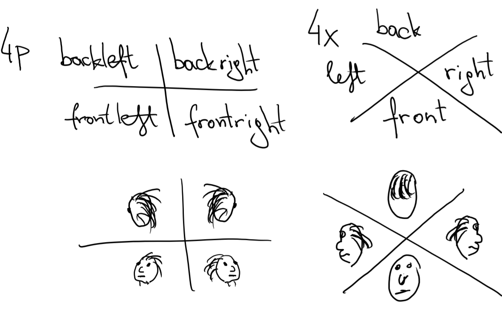

# BiternionNets-ROS
An implementation of [BiternionNets](http://www.vision.rwth-aachen.de/publication/0021/) for ROS, ready to run on a robot.

Install instructions
--------------------

Most ROS installations are using Ubuntu, this is the recommended way.

There are two versions of the code in this repo:
- The original version (`v1`) is based on my `DeepFried2` toolbox
  and `Theano`, for which most code and this README are written.
  The problem is that `Theano` and hence my toolbox are discontinued.
- The new version (`v2`) uses the newer `PyTorch` library.
  Unfortunately, I don't have the time to port everything, so it is
  a little less documented, especially the training part.
Which version is used only depends on which model you choose as a parameter
when launching `predict.launch`.

### Setting up a virtualenv

This step is common to both versions:

```
$ sudo apt-get install python-virtualenv libopenblas-dev liblapack-dev gfortran
$ virtualenv --system-site-packages pyenv
$ . pyenv/bin/activate
$ pip install --upgrade numpy
```

You'll always have to run `. pyenv/bin/activate` when you open a new terminal
and expect to use BiternionNets.

Now on to the version-specific dependencies:

### Installing the original Theano-based version

```
$ pip install Theano==0.9.0
$ pip install git+https://github.com/lucasb-eyer/DeepFried2.git
$ pip install git+https://github.com/lucasb-eyer/lbtoolbox.git@18ef22987088c9eb3153abf37dc30abe027b2708
```

In case you are still using Python 2.x, there will be errors when installing `lbtoolbox`.
You can safely ignore these as they happen in parts which are not used here.

You can now do the following now and hope there's no error.
It may take a while since it is pre-compiling quite some things:

```
$ python -c 'import DeepFried2'
```

### Installing the new PyTorch-based version

Follow the [instructions on the official PyTorch website](https://pytorch.org),
but make sure to choose the `pip`-based version (and have the venv activated).

You can test if it worked by running the following and seeing no error:

```
$ python -c 'import torch'
```

Training a model
----------------

This tutorial explains how to collect, label, load and use data to train a model for your application scenario.
This happens in a similar way as described in Section 5.1 of [the original paper](http://www.vision.rwth-aachen.de/publication/0021/).

### Data Collection

As a first step, you need to collect training data and dump it as a set of pictures.
Ideally, this is done with exactly the same system as will be run in production so as to get the best model possible.
Good training data can be recorded by asking as many people as possible (one after the other) to stand in front of the robot's camerase and turn on the spot, or walk in small circles.
This data should then be used to dump images of that person using the same vision/perception system as will be run later.

In our case, we did this with two different perception stacks:

- The STRANDS stack, using our [upper body detector](https://github.com/strands-project/strands_perception_people/tree/indigo-devel/upper_body_detector)
  and/or [pedestrian tracker](https://github.com/strands-project/strands_perception_people/tree/indigo-devel/mdl_people_tracker).
- The [SPENCER stack](https://github.com/spencer-project/spencer_people_tracking), using the same base components.

You can either use these stacks and the provided `dump_tracks.launch` (most tested with the SPENCER stack) and `dump_ubdcpp.launch` or take inspiration from them and adapt them to your stack.
`dump_tracks.launch` can be used this way, for example:

```
roslaunch biternion dump_tracks.launch wfactor:=0.8 hfactor:=0.3 subbg:=true bgcoeff:=0.4 dir:=~/dump/bagfile01/
rosbag play --rate 0.3 your_bag_file_01.bag
```

This will dump images of the tracked person in the playing bagfile, cutting out the top 30% of the tracker bounding-box (`hfact:=0.3`) and
reducing the width to 80% of the tracker bounding-box (`wfact:=0.8`).
It will also do background-subtraction (`subbg:=true`) using depth data by discarding pixels further than 1m from the 40-percentile (`bgcoeff:=0.4`) of the boxes' depth values, in order to make the training more robust.
Finally, all pictures will be dumped to the folder `~/dump/bagfile01`.

### Labeling

Now when we have all the pictures of the heads, we rescale them to the same size (TODO: add imagemagick command) and split all the dataset two times:

    /4p
       /backleft
       /backright
       /frontleft
       /frontright
    /4x
       /back
       /front
       /left
       /right

The `4p` and `4x` folders contain the same pictures but sorted differently. `p` here stands for plus sign (`+`), and `x` for a cross.
The rough idea for this labeling is the following:



Labeling the data in this way is very fast and simple: open the dump in a file-browser, enable thumbnails and then drag-select a whole bunch of images to the corresponding label-folder, e.g. `4p/backleft`.
We recommend you think of specific things to watch for by labeling, e.g. in the `+` case, it's very effective to look at the person's nosetip, whereas for the `x` case the cheeks and eyes are helpful.

### Training

Given a labeled folder layout as described above, to train a new network simply run `scripts/train.py`:

```bash
rosrun biternion train.py -d data_dir
```

`data_dir` should contain the `4p` and `4x` folders that we prepared in the previous step. To get other parameters run:

```bash
python train.py -h
```

After training you will have .npz file. And now it's time to use it for prediction.

TODO: describe about using making/using different models.

### Prediction

Prediction parameters are in `launch/predict.launch` file. Specify your model (`model` argument) here and the trained .npz file (`weights`).

Prepare ROS for prediction:

```bash
source /opt/ros/indigo/setup.bash #source your ROS setup file
roscore #start roscore
```

But if you just want to t est it on a bagfile, don't forget to set sim_time beforehand!

```bash
rosparam set use_sim_time true #make ros use simulation time
roslaunch spencer_rwth all.launch sensor_frame:=front
rosbag play --clock -r 0.3 bagfile_here #play some data with rosbag
```

Run the prediction node finally:

```bash
roslaunch biternion predict.launch
```

After that you can open rqt and check your predictions.

